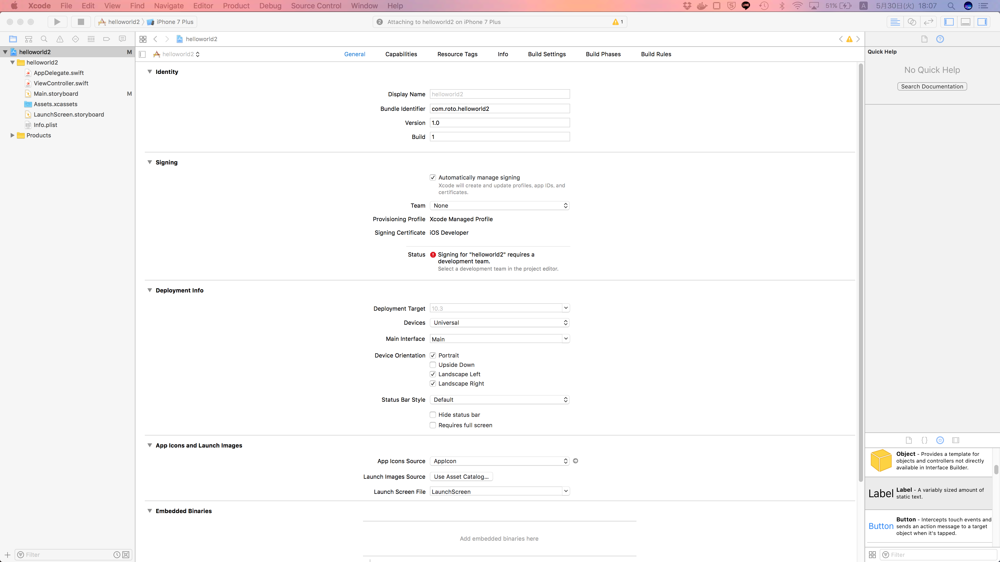

# Fintech-FUN iOS勉強会第1回 2017/05/30資料

## Xcodeの導入
すでにXcodeがインストールされていれば不要
App Storeからダウンロード（時間がかかるかも）
上のメニューバーから
**Xcode** > **About Xcode**
でXcodeのバージョンを確認(8.X.Xであれば良い)

## 新規プロジェクトの作成
メニューバーから
**File** > **New** > **Project**
今回は **Single View Application** を選択して，**Next**

**Product Name** を入力して **Next**
保存するディレクトリを選択して **Create**

このような画面になればOK

## storyboard
### オブジェクトをドラッグ&ドロップで配置する
左側にあるProject Nameなどが並んでいる場所から **Main.storyboard** をクリック

すると，真っ白なView Controllerが出てくる．オブジェクトを追加する際は，以下の手順で操作する
1. 右下にある枠から丸いアイコンを押す
1. オブジェクトライブラリが表示される
1. 追加したいオブジェクトをドラッグして，View Controllerにドロップする
 1. 上の方にある黄色のオブジェクト(View ControllerやStoryboard Referenceなど)はView Controllerの外に配置する
 1. 下の方にある黄色ではないオブジェクト(LabelやButtonなど)はView Controllerの中に配置する
1. 右のほうにある枠を操作することで，配置したオブジェクトに様々な変更(テキスト・色・サイズなど)を加えることができる

### storyboardによる画面遷移
**Segue** という機能を使って遷移先を決めることができる  
1. 新しいView Controllerを配置する
1. この時点で2つのView Controllerが存在するはず，それぞれのView Controllerにボタンを配置して，表示名を変更する．
 1. わかりやすくするために，背景色を変えておくといいかも
1. **Controlキー** を押しながら遷移前の画面に配置したボタンをドラッグして，遷移先の画面にドロップする．
 1. うまくドラッグできてると，線が出てくるはず
1. すると，Action Segueというメニューが表示されるので，Showを選択
1. 遷移前から遷移先への矢印が表示されれば成功
1. 同じ要領で画面の行き来ができるようにすると良い

