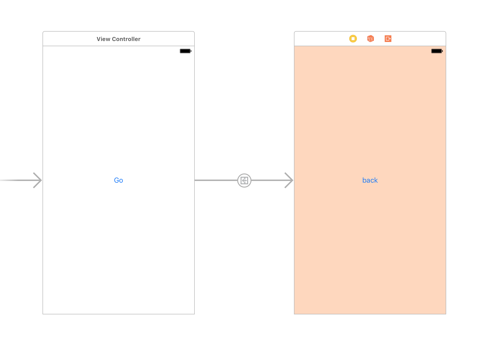

<style>.syntax--plain{color:black;} #fintech-fun-ios-2-2017-06-05-{font-size:2.0em;}</style>
# FinTech-FUN iOS勉強会第2回 2017/06/05資料

## let/varを使った宣言について
Swift3では，定数(let)と変数(var)という型がある．定数(let)で宣言した場合は，値に変更を加えることができない．一方，変数(var)で宣言した場合は，値を後からでも変更することができる．また，一般的にはInt型やString型などの明示的に宣言する必要がある．

```
var i: Int = 0            //変数のIntを宣言し，iに0を代入
let j: Int = 5            //定数のIntを宣言し，jに5を代入

i = 9                     //iに9が代入される
j = 6                     //エラーが出てくる
```
**定数(let)は再代入不可**　→　変更しない値を使いたい時に利用  
また，以下のようにInt型やString型を明示的に宣言しなくても良い場合がある．(型推論)
```
var i = 0                 //変数iにInt型の0を代入→iはInt型になる
let j = "HelloWorld"      //定数jにString型を代入→jはString型になる
```

## ViewControllerについて
iOSに限らず，アプリケーション開発(Web含む)の様々な場面でViewやControllerなどの概念がある．これを **MVC(Model View Controller)** という．
- Model       : データ・ロジックを扱う
- View        : いわゆる画面，見える部分を扱う
- Controller  : 入力を受け取り，ModelやViewへ命令する


~~このようにMVCは役割を分担することで，管理・操作しやすくする．当然ファイルもMVCそれぞれに分けることが多い．
しかし，MVCを完全に分けない方法もいくつかある．Model + Controller，View のようにすることもある．直感的にこの方法はわかりやすいので，
今回の演習では，この方法を扱いたい．~~ ←話が逸れ過ぎているので…

ViewControllerとは，**Viewを操作するためのController** である．

## コードからオブジェクトを生成
オブジェクト : ボタンやラベルなどの画面に配置して，値の入出力をするためのもの ~~本来はオブジェクトを扱えるようにしたものをインスタンスと呼ぶ~~  
ViewController.swiftというControllerを記述するswiftファイルに記述する．

**UIButton()** や **UILabel()** などを利用する
以下のようなコードをViewController.swiftに書けばラベルの作成ができる．

```swift:ViewController.swift
/*ViewController.swift*/
import UIKit

class ViewController: UIViewController {

  override func viewDidLoad(){
    super.viewDidLoad()
    let label1 = UILabel()                    //UILabelというオブジェクトをlabel1として作成
    label1.text = "Hello World"               //label1のテキストを"Hello World"に変更
    label1.textColor = UIColor.red            //label1のテキストカラーを赤に変更
    label.sizeToFit()                         //label1のテキストを表示するだけに必要な大きさに設定
    label1.center = CGPoint(x: 200, y: 100)   //label1の位置を指定
    self.view.addSubview(label1)              //label1をViewに追加
  }

  override func didReceiveMemoryWarning() {
    super.didReceiveMemoryWarning()
    // Dispose of any resources that can be recreated.
  }
}
```

- 注意点)
 - **self.view.addSubviewで画面に追加しないと表示されない**
 - **オブジェクトはサイズが指定されてないと表示されないこと**
 - コードで生成したオブジェクトは色が白+透明のため，背景白だと見えない

各パラメータ(label1.◯◯の◯◯)はUIButton()やUILabel()で異なる場合があるので注意すること(実際にUIButtonとUILabelとでは，テキストの扱い方などが異なる)

UIButton()の例も以下に挙げる

```swift:ViewController.swift
/*ViewController.swift*/
import UIKit

class ViewController: UIViewController {

  override func viewDidLoad(){
    super.viewDidLoad()
    let button1 = UIButton()
    button1.setTitle("Hello World", for: UIControlState.normal)        //未タップ時のbutton1の表示を"Hello World"に変更
    button1.setTitleColor(UIColor.red, for: UIControlState.normal)     //未タップ時のbutton1のテキストカラーを赤に変更
    button1.sizeToFit()
    button1.center = CGPoint(x:200, y:200)
   //button1の位置と大きさを指定
    self.view.addSubview(button1)              //button1をViewに追加
  }

  override func didReceiveMemoryWarning() {
    super.didReceiveMemoryWarning()
    // Dispose of any resources that can be recreated.
  }
}
```

- 注意点)
 - **self.view.addSubviewで画面に追加しないと表示されない**
 - **オブジェクトはサイズが指定されてないと表示されないこと**
 - UILabel()と違い，.text = ではなく，setTitle() となっている
 - setTitleの引数のUIControlState.normalはタップしてない時の表示テキストを設定
 - setTitleの引数をUIControlState.highlightedにすれば，タップ時の表示テキストを設定

以上のように，コードからオブジェクトを生成することができる．Storyboardで作成したオブジェクトをコードで操作することもできる．
次の項目では，オブジェクトをコードに適用する方法を説明する．

## Storyboardからオブジェクトをコードに適用
Storyboardで作成したオブジェクトをコードで扱えるようにする．オブジェクトとコードの **リンク** という
以下の手順でやるといい．今回はボタンの例であるが，Labelや他のオブジェクトでもできる．  
画面右上にあるリングが重なっている場所をクリック．


すると画面が二つに分割され，StoryboardとViewController.swift(コード)が表示される．


ボタンによる画面遷移(Segue)でやったように，Control押しながらボタンをコードにドラッグする．すると以下の画面のようになる．ボタンを扱うための変数名を入力する．


無事成功すると，

`@IBOutlet weak var button1: UIButton!`

というコードが追加される．  
これで，前項で行ったような.setTitle()やsetTitleColor()などのコードで操作できる．

## ボタンにイベントを追加
これまでは，作成したボタンの色やテキストなどを変えるという見た目の変更とボタンを押した時の画面遷移のみを行ってきた．ここからは，**ボタンを押した時** に任意の動作（例:画面の色を変えたり，変数の値を増やすなど)ができるイベント処理を追加する．
今回の例では，ボタンを押すとカウントが増えるプログラムを作る

**準備**  
StoryboardでLabelとButtonを追加して，ViewController.swiftとリンクさせる．

```swift:ViewController.swift
/*ViewController.swift*/
import UIKit

class ViewController: UIViewController {

    @IBOutlet weak var button1: UIButton!
    @IBOutlet weak var label1: UILabel!

    var change = 0;                        //カウントするための変数

    override func viewDidLoad() {
        super.viewDidLoad()

        label1.text = String(change)

        /*ボタンにイベントを追加する*/
        button1.addTarget(self, action:#selector(self.clickAction(sender:)), for: .touchDown)
    }

    /*ボタンを押したら発火させる関数(イベント処理の中身)*/
    func clickAction(sender: UIButton) {
        change += 1
        label1.text = String(change)
    }

    override func didReceiveMemoryWarning() {
        super.didReceiveMemoryWarning()
        // Dispose of any resources that can be recreated.
    }
}
```

- clickAction関数はボタンが押された時に動作する．
 - 関数名は任意で良い．
 - 仮引数は，「UIButtonから呼ばれるよ」という意味である．
- addTarget()がイベントをボタンに追加する関数である．
 - 第1引数 :  **self** self以外はまずない
 - 第2引数 :  **action:** selectorというものでClickActionを呼ぶ
 - 第3引数 :  クリックにも色々種類(押した瞬間，離した瞬間など)があり，それを指定する．今回は，クリックした瞬間の.touchDown．

## 遷移先画面から元の画面に戻る方法
前回した方法は，画面遷移にはSegueを使い，元の画面に戻るときも画面にSegueを繋いで画面遷移をしていた．しかし，この方法は画面遷移のたびに新しい画面を作っているので，何度も画面遷移を繰り返すとアプリが重くなってしまう．  
そこで，画面を新しく作らず元の画面に遷移する方法を紹介する．(ドットインストールで紹介されている)

まず，StoryboardでViewController2つ作成し，それぞれにボタンを1つずつ設置する．初めの画面からもう1つの画面へ遷移させるSegueを作る．



次にViewController.swiftを以下のように書き換える．

```swift:ViewController.swift
/*ViewController.swift*/
import UIKit

class ViewController: UIViewController {
  @IBAction func unwindToTop(segue: UIStoryboardSegue){

  }
  override func viewDidLoad() {
        super.viewDidLoad()
  }
  override func didReceiveMemoryWarning() {
    super.didReceiveMemoryWarning()
    // Dispose of any resources that can be recreated.
  }
}
```
@IBAction func unwindToTop(segue: UIStoryboardSegue)は画面を戻す以外何もしないので，処理は書いていない．  

遷移先のボタンをControl押しながらドラッグ．ViewControllerの上に3つのアイコンが出てくるので，右にドロップ. すると，以下の画面のようになる


unwindToTopWithSegueを選択する．  
これで起動してみると，新規に画面を作成しないで元の画面を表示することができる．

## 画面遷移で値を受けわたす
View1つにつきControllerは1つ割り当てるのが一般的．画面遷移で値を受けわたす為には，複数画面に対応したコードが複数存在する必要がある．まず，ViewControllerを複数つくり，コードと対応させる．
別のViewController.swiftを作るには，ツールバーにある File > New > Fileから，Cocoa Touch Classを選択し，Class名を任意のもの(ここではViewController2とする)に設定する．Subclass ofはどのクラスをベースに使うかというもので，今回のようにViewControllerを作りたい場合はViewControllerを選択してNextを押す．どこに保存するかを選んで(普通はプロジェクトディレクトリ)Create  
Storyboardでの配置は以下の画像のようにするといい．画面遷移もできるように．(今回はカウントの数値を受けわたす)


```swift:ViewController.swift
/*ViewController.swift*/
import UIKit

class ViewController: UIViewController {

    @IBAction func unwindToTop(segue: UIStoryboardSegue){

    }
    @IBOutlet weak var label1: UILabel!
    @IBOutlet weak var button1: UIButton!

    var count = 0
    override func viewDidLoad() {
        super.viewDidLoad()
        label1.text = String(count)
        button1.addTarget(self, action:#selector(self.clickAction(sender:)), for: .touchDown)
    }

    override func didReceiveMemoryWarning() {
        super.didReceiveMemoryWarning()
        // Dispose of any resources that can be recreated.
    }

    func clickAction(sender: UIStoryboardSegue){
        count += 1;
        label1.text = String(count)
    }

    override func prepare(for segue: UIStoryboardSegue, sender: Any?) {
        let viewController2 = segue.destination as! ViewController2
        viewController2.count = count
    }
}
```

```swift:ViewController2.swift
/*ViewController2.swift*/
import UIKit

class ViewController2: UIViewController {

    @IBOutlet weak var label2: UILabel!
    var count: Int = 0

    override func viewDidLoad() {
        super.viewDidLoad()
        label2.text = String(count)
        // Do any additional setup after loading the view.
    }

    override func didReceiveMemoryWarning() {
        super.didReceiveMemoryWarning()
        // Dispose of any resources that can be recreated.
    }
}
```

プログラム自体は，これまでの内容を組み合わせたものに値渡しに必要なものを追加したものである．受けわたす為には，まずViewController2.swiftで受け取る為の変数を定義する．  
次に受け渡しをする為の関数prepareをViewController.swiftで呼び出す必要がある．prepareの引数はSegueで値渡しする際はだいたいこのようになる．

`let viewController2 = segue.destination as! ViewController2`

segue.destinationは遷移先の変数にアクセスできる．これを定数に代入して，遷移先のコントローラーに値を渡すことができる．
