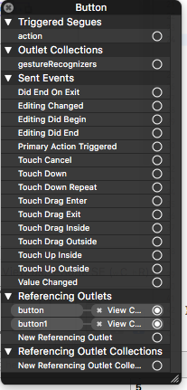
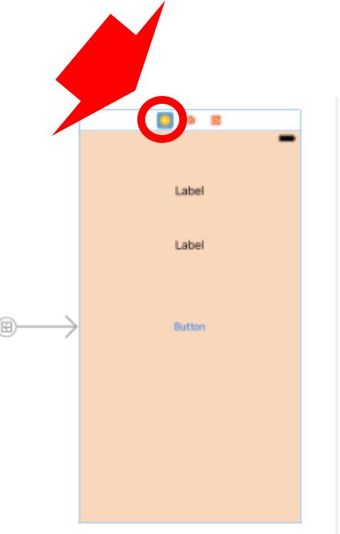
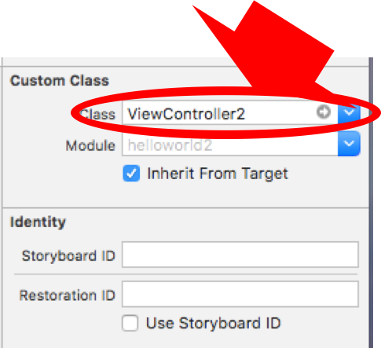

<style>.syntax--plain{color:black;} #fintech-fun-ios-4-2017-06-19-{font-size:2.0em;}</style>
# FinTech-FUN iOS勉強会第4回 2017/06/19資料

前回までの内容でSwiftだけで行えるアプリケーションは作成できる．少なくとも，画面遷移ができ，データを端末に保存することができるので，複雑ではないアルゴリズムのアプリケーションは作成可能．

## 自分でコードを書いていくために…
これまでの資料では，手順通りにSwiftでの開発をしてもらい，iOSのアプリケーション開発はどのようなものか，基本的な知識を身につけもらうための説明を行ってきた．しかし，エラーや意図しない挙動への対処は説明を行っていない．ここでは，"これまでの資料で起こりうる代表的なエラーの対処方法"と"エラーや挙動からどのように対処すれば良いかのノウハウ"を示す．

### よくあるエラー
#### タイプミスや定義ミス　(no member), (unresolved identifier)
よくあるやつです．まず最初にこれを疑いましょう．また，大文字小文字が混ざるAPIが多いので特に注意すること．自分で定義した変数・定数・関数を呼び出す時にも，スペルミスや勘違いはよくあるので，気をつけましょう．  

#### 空白の位置が異なる　エラーは出ないが，実行時に反映されない
Swiftでは，空白が重要になることが多いです．（エラーを再現できなかったのですが(バージョンによって異なるっぽい)，以下のプログラムのようにするとできないこともあるので要注意）
```swift:
var i : Int = 30    //→◯
var i : Int=30      //→×
label1.textColor = UIColor.red     //→◯
label1.textColor=UIColor.red       //→×
```

#### Storyboardとコードのリンクで不都合が起こる
Storyboardとコードをリンクさせたが，Storyboardあるいはコードのリンク部分を削除した場合，実行するとエラーが出る．  
例えば，ボタンを作成しコードとリンクさせた．コードの`@IBOutlet weak var button1: UIButton!`を削除して，別の名前をつけてもう一度コードとリンクをさせ，実行させると *NSUnknownKeyException* というエラーが出る．これを解決するには，Storyboardで対象のオブジェクトをControl+クリックで情報を表示し，重複している部分を削除する．以下に例を出す．
```swift:
    @IBOutlet weak var button1: UIButton!
```
というコードを一度削除して，もう一度ボタンと別名でリンクさせる．
```swift:
    @IBOutlet weak var button: UIButton!
```
これで実行するとエラーが起こる．なので，原因がありなそうなオブジェクトをControl+クリックする．

  

この画像の下にあるbutton1を削除すると解決する．  

#### 型が異なる変数に代入しようとする場合
例えば，Int型で宣言した変数にStringを代入しようとするとエラーが出る．*Cannot assign value of type "String" to type "Int"* というエラー．**その変数をどういう処理に使うか** によるが，StringをInt型にキャストするか，String型の変数に代入するかである．

#### Storyboardとコードを紐付けできない場合
新しくStoryboardに作ったViewControllerのオブジェクトとコードを紐付けしようとする時に，紐付けができない時がある．ViewControllerとコード自体の対応ができてないのが原因で起こる．StoryboardのViewControllerの上にある3つのアイコンの左をクリック．すると，右側のウィンドウがのCustomClassの部分が表示される．そのClassを紐付けしたいコードファイルにすればできる．





### エラーなどへの対処方法　ノウハウ
アプリケーション開発にエラーはつきものだということは，ここまでの資料や学校の講義を経て十分感じていると思います．用意された課題や手順は正しければエラーが起こらない・必ず実行できる・想定された挙動をするようにできています(答えが存在する)．しかし，一般的にプロジェクトでは，答えが存在しないプログラムを開発します．想定された挙動をどうやって実装するか自分で考え，コードを書いていかないといけない．そんな時の助けになるようなことを書いていきたいと思います．**必要に応じて読んでもらえればいいです．**  

- **ネットにあるプログラムはそのまま使えない**
 - ネットに落ちているコードを参考にすることもよくあります．しかし，環境(version)が異なっていたり，変数自体も違っていたりと，そのままコピペして使えるケースはまずありません．
 - コピペをするというよりも，どういう処理にどんな関数を使っているかを参考にするという心構えが大切です．
- **エラーを調べてみる**
 - プログラム言語(特に主流なもの)は世界中で使われている．同じようなエラーに苦戦している人も多くいて，知恵袋のようなサイト(stack overflowなど)に同じような質問をしている人がいます．ただし，プログラム言語の質問は基本的に英語です．
  - プログラムに関する英語サイトの内容を効率よく知るには，書いてあるコード(特に回答者のコード)を読むこと．欲しい情報はそこにありますが，バージョンや環境の違いがあるので，鵜呑みはしないこと．
- **日本語で検索ヒットしないなら英語で検索**
 - Qiitaという技術的なことが日本語でまとめられているサイトがあり，結構便利です．
 - 便利ですが，Qiitaにはまだ投稿されていないものはたくさんあるので，日本語だけでは対処しきれません．なので，Google先生に英語で質問してみましょう．
 - Swift3.0は新しい言語なので，検索の対象期間を1年間にしたりとすると，意外とヒットするかもしれないです．
- **メモしておく**
 - どういう手順で行なってみたがダメだったみたいなメモをしておくと，後で見返した時にひらめいたり，それとは違うアプローチを見出しやすくなったり，色々便利です．
 - これはそこまで推奨しないですが，結構成長できるんじゃないかと思います．
- **色々試してみる**
 - 上では「参考にして」と言ってますが，具体的にはどうするか．
 - 試してダメなら，どこがダメだったかをまず考える．
  - APIの導入で詰まったら，提供されているAPIのドキュメントを見て，自分のプログラムで動かすにはどうすればいいかを考える．
  - アルゴリズムで詰まったら，自分がやりたいことを書き出す．それをどうやれば実現できるかをとにかく考える．
 - 考えた上で色々試して見る．一度動作すれば，そのAPIとアルゴリズムは君の能力になる．応用に活かすこともできる．
- **デバッガーを使ってみる**
 - デバッグをすることで，変数にはどんな値が代入されているのか，どこでエラーが出ているのかがわかる．
 - 使い方は 「xcode デバッガ」 で調べるとXcodeでのデバッグのやり方が色々出てくるので，調べてやってみてね．
