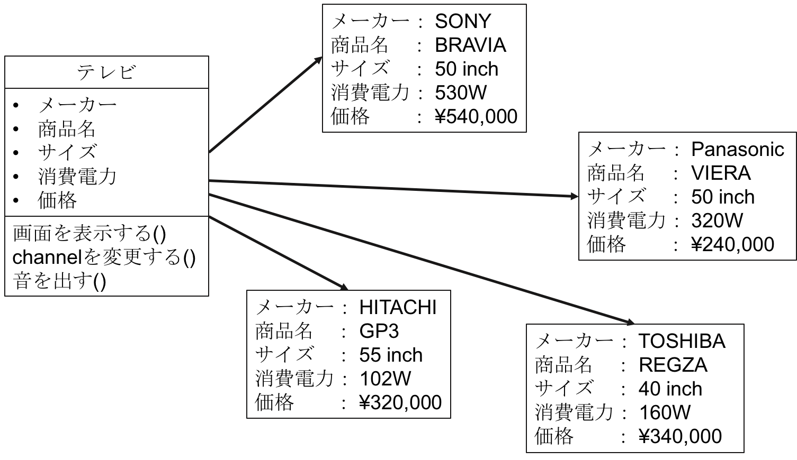

<style>.syntax--plain{color:black;} #fintech-fun-ios-5-2017-07{font-size:2.0em;}</style>
# FinTech-FUN iOS勉強会第5回 2017/07資料


## slackで質問されたこと
```swift:
var obj: [key:value]
var obj: Dictionary<key,value>
```
※keyとvalueには型が入る．
の違いがわからない．上の[]はDictionaryを宣言する簡易バージョン，下の<>はDictionaryを宣言する元のやつ，結局は同じことを指している．初期化する時にも似た感じでできる．下は簡易的に宣言したものにDictionaryのインスタンスを代入する2種類の方法を用いてる．
```swift:
var obj: [key:value]      //簡易的な宣言
obj = Dictionary<key,value>()    //Dictionaryの元の形で初期化  (丸かっこの前は空白あってもなくてもいい)
//obj = [key:value] ()        //簡易的な形で初期化 (丸かっこの前は空白あり)
```

## 関数でのリターンの仕方
swiftに限らず他の言語でも，関数でreturnを利用する時には返り値の型が必要になる．swiftでも当然返り値の型が必要になる．
```swift:
func calcAdd(a: Int, b: Int) -> Int{
  return a + b
}
```
上記のように，`-> 型名`で返り値の型を宣言することができる．

## オブジェクト指向プログラミング
**オブジェクト指向についてある程度理解している人は読み飛ばしてくれて大丈夫です．**
オブジェクト指向について，理解してもらえるとアプリケーション開発に役立つはず．それ以外にも様々な場所でこの考え方は利用されているので，身につけておいて欲しいです．(今年度のFinTechのiOS開発でどれくらい役に立つかは不明)．これまで実際にButtonやLabelなどを作成するのが簡単にできるのは，このオブジェクト指向に基づいているからです．Swiftだけでなく，JavaやC#などをオブジェクト指向言語と呼びます．  

- このページを参考にしてます．  
 - <https://eng-entrance.com/what-oop>  
 - **<http://www.atmarkit.co.jp/ait/articles/1511/17/news015.html>**  

**※正直，オブジェクト指向は説明するのが難しいです．** 自分も2年前，初めて触れた時意味がわからなかった…　色々さわっていくうちに自然と意味がわかっていったので，**今回は軽く基礎知識みたいなのを身につけてもらえればと思っています．全体的なざっくりしたイメージを理解してください．**  
夏休み前までに，最低限理解して覚えて欲しいもの→オブジェクト(インスタンス)・クラス・メソッド(操作)・プロパティ(属性)
開発本格的な開発前に理解して欲しいもの(設計書からコードを書くには必要な知識)→カプセル化・継承

### オブジェクト指向とは何か
簡単に言えば，プログラムを現実世界の様々なものに近づけることで，開発・管理・運用しやすくするもの．  
例としてテレビをあげる．**どのメーカーのどんなテレビ** でも，チャンネルを記憶していて，リモコンで操作し，画面を表示させることができる．このように，全てのテレビは共通のデータ(チャンネル)や機能(リモコン操作・画面表示)を持つ．量産・改良することをイメージして欲しい．SONYやPanasonic・HITACHIなどの各種メーカーが新型テレビに対して，同じデータと同じ操作を毎回プログラムするのはコストがかかる．過去に作ったテレビの機能を流用したい・メーカー共通のテレビのフレームワークを作っておきたいという考えになります．そんな時にオブジェクト指向が便利です．共通のデータや操作ができるように同じような中身の関数や変数をなんども定義しなくてもいい．とか色々利点があります．  
あくまでテレビは例なので…　ご了承ください

#### そもそもオブジェクトとは
オブジェクトとは，「対象」「物」という意味で、プログラミングにおいては **データと処理の集まり** である．  
テレビの例　各メーカーのそれぞれのテレビがオブジェクトである．


このテレビの例では，メーカー名やサイズなどのテレビの基本データしかない．これにテレビの処理を追加してみる．


それぞれのテレビに対して，画面表示・チャンネル変更・音出力という処理が追加された．(基本的な処理のみを追加)  
このように，データと処理が一つの塊として扱うことができるのが，オブジェクトである．また，インスタンスという言葉をよく聞くかもしれないが，オブジェクトと同意であるという認識で良い． **オブジェクト＝インスタンス**

#### クラス
上のオブジェクトの説明で，共通のデータや処理が追加された．テレビのサイズや価格などが表記されていないと，購入する際に比較するのが非常に不便になる．このようなデータや処理の追加を必ず表記するためには，設計書(企画書)があるといい．設計書からテレビ(オブジェクト)を作るとミスなく同じものを作ることができる．設計書の役割を果たすのがクラスである．  
テレビクラスは以下のようになる．


このクラスから様々なテレビを作成することができ，それぞれのテレビは共通して同じ処理をすることができる．



**インスタンス(オブジェクト)はクラスから作られる** このインスタンスを作ることを **インスタンス化** とも呼ぶ．

#### プロパティ(属性)
インスタンスが持つデータのことをプロパティ(属性)という．テレビだと，「メーカー」や「価格」などのこと．それ以外にも，オブジェクトの状態を表すデータ「テレビがついている」，「現在のチャンネル」なども存在する．上記のテレビの例の図を見てもらえばわかるように，「メーカー」や「価格」はそれぞれのインスタンスごとに保持している．

#### メソッド(操作)
オブジェクトが持つ処理のことです．テレビだと，「画面を表示する」や「音を出力する」がメソッドに当たる．クラスの中では，同じ名前かつ同じ引数のメソッドは複数定義できない．C言語と違って，仮引数の数や仮引数の型を変えれば同じ名前のメソッドを定義することができる．

#### コンストラクタ
参考：<http://swift.tecc0.com/?p=262>  
クラスを呼び出してインスタンスを作成する時に，必ず最初に呼ばれる関数がある(定義しない場合は，親クラスのコンストラクタを呼び出したりと色々条件があるため，今年度の演習ではインスタンスを生成するためのクラスでは必ずコンストラクタを定義していきたいと思います）．通常コンストラクタと呼ぶが，Swiftではイニシャライザと呼ばれる．(調べるときはイニシャライザで調べるとより正しい情報が出てくるかも？)．このコンストラクタでは，プロパティの変数に値を代入したり，前処理のメソッドを呼び出したりと様々なことをする．同じクラス名だが引数の数によって異なるインスタンスとして宣言できるのは，このコンストラクタの引数に依存しているからである．Javaでは，クラス名を関数として定義することで呼び出すことができるが，**Swiftではinit()** という関数をクラス内に定義することによってクラスを呼び出すだけでコンストラクタを呼び出すことができる．  
以下にクラスの呼び出し(インスタンス化)とコンストラクタの定義の仕方を示す．

```swift:
class Student{
  var name : String
  var gender : String
  var no : Int

  init(){
    self.name = "mirai"
    self.gender = "M"
    self.no = 1090999
  }

  init(name : String, gender : String,  no : Int){
    self.name = name
    self.gender = gender
    self.no = no
  }
}

//別の関数やページのクラスで記述
let student = Student()                           //Studentを引数なしで初期化
print(student.name)                               // "mirai"

let student2 = Student("Takagawa", "M", 1014223)  // 引数ありで初期化
print(student2.name)                              // "Takagawa"
```

ここで **self** という見慣れないものがあると思う．これはそのクラスの持つメンバ変数(プロパティ)を利用するという意味でinitの仮引数と被っている部分があるが，重複した時でもメンバ変数との差別化を測ることができるものである．  
また，**student.name** という表記もある．これはstudentインスタンスのnameというプロパティを参照するという意味になる．値を読んだり，代入することができる．

#### カプセル化
カプセル化とは，インスタンスの中身を外側から見えないようにする．中身に変更を加えたいときは，必ずインスタンスを経由して変更するというものである．Google先生でGetter/Setter(ゲッター/セッター)と調べるといろいろ出てくる．privateやpublicなど様々なアクセス修飾子(アクセスコントロール)を変数につけることで，そのソースコード内だけでアクセスできたり，他のソースコードからでもアクセスできたりとすることができる．  
※カプセル化は説明が難しいのでご了承ください．
Swift3.0では以下の5つを使うことができる．
Javaのprivateとはかなり特徴が異なっているので注意．特に，private internal publicを覚えて欲しいですが，privateのみを具体的に説明します．
- **private     : 定義されたスコープ内でのみアクセスできる**
- fileprivate : 同じソースファイル内からのみアクセスできる**
- **internal    : 同じモジュール内からのみアクセスできる(デフォルト)**
- **public      : 同じモジュール内だけでなく、別のモジュールからでもアクセスできるが、別モジュールでは継承、オーバーライドはできない**
- open        : 同じモジュール内だけでなく、別のモジュールからでもアクセスでき、別モジュールで継承またはオーバーライドができる


privateの使い方．同じスコープ内のみで使用できる．上は実際にhelloメソッドを呼び出せば，Helloと表示されるが，下は，mesメソッドを呼び出した後に，helloメソッドを呼び出してもHelloは表示されない．
```swift:
class Say{
  private let message = "Hello"
  func hello(){
    print(message)
  }
}

class Say{
  func mes(){
    private let message = "Hello"  
  }
  func hello(){
    print(message)
  }
}
```

カプセル化の一般的なコードを以下に示す．上のsetMesメソッドはString型を引数として受け取り，privateのmes変数に代入する．下のgetMesはprivateのmes変数をリターンする．このようにすることで，暗黙的にmes変数の値が変わることがなくなる．mes変数を変更/参照したい場合は，これらのgetter/setterを明示的に使う．getter/setterの命名規則はset〇〇/get〇〇というふうにする．
```swift:
class Say{
  private var mes;
  public func setMes(message : String){
    mes = message
  }
  public func getMes() -> String{
    return mes
  }
}
```

#### 継承
参考: <http://swift.tecc0.com/?p=275>
オブジェクト指向では，他のクラスの内容を引き継いで新しいクラスを作ることができる．例えば，日本人は名前と性別を必ず持っている．未来大生は名前と性別と学籍番号を持っている．日本人と未来大生の抽象度を比較すると，日本人＞未来大生である．学籍番号を持つとより具体的な一人の日本人を特定できるというのを「抽象度が低い」といい，日本人という括りでしか捉えられないのを「抽象度が高い」という．  
ここで日本人と未来大生のクラスを作るとする．クラスの持つプロパティを以下のように設定する．
- 日本人     → name : String, gender : String
- 未来大生   → name : String, gender : String, no : Int

このように，日本人と未来大生を別々に定義することもできる．しかし，未来大生のプロパティと日本人のプロパティで同じnameとgenderが存在する．同じプロパティをわざわざ宣言する必要はないので，どうにかして，日本人のプロパティを未来大生のプロパティに反映させたいというときがある．そんな時に **継承** をすると良い．

```swift:
class Japanese{
  var name : String
  var gender : String

}

class FUNstudent : Japanese{
  var no :String
}
```

このように宣言することで，FUNstudentで作成されたインスタンスは変数no以外に，変数nameと変数genderを使うことができる．
他にもメソッドを宣言しても継承さえすれば，そのメソッドを継承先で利用することができる．
`super().メソッド名()`で親クラスのメソッドを呼び出せる．(引数は適宜利用)  
`super()`で親クラスのコンストラクタを呼び出せる．(引数は適宜利用)


**以上がオブジェクト指向の最低限必要な知識です．何度も書いてますが，理解するのは時間をかけるべきだし，時間がかかるのでなんとなくこういうものがあるのかという認識で大丈夫です．**
