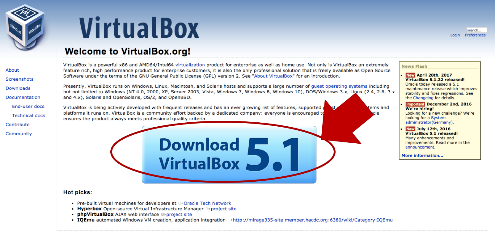
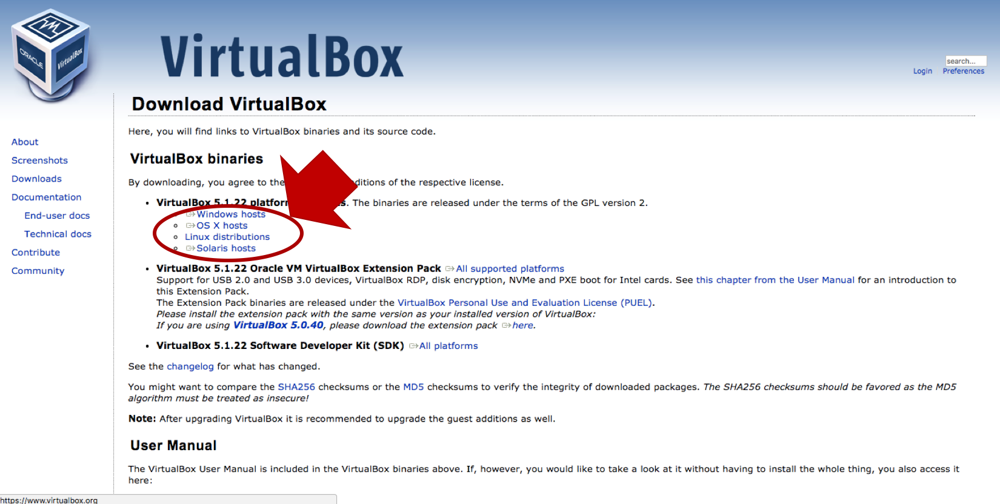

# Install FreeBSD on VirtualBox
## 環境
- Mac OS 10.12.4 (Sierra)
- Virtualbox 5.1.22
- FreeBSD-10.3-RELEASE

## VirtualBoxの導入
<https://www.virtualbox.org/>  にアクセス

自分の環境にあったものを選択するとダウンロードが開始．今回はOS X Host

