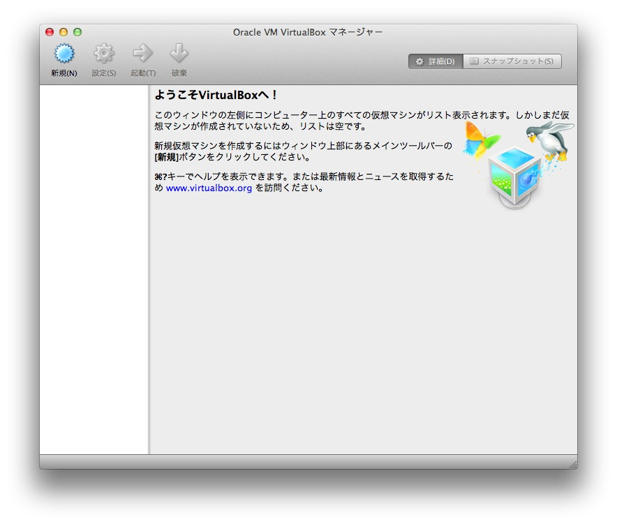
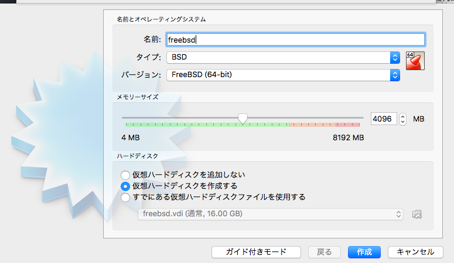
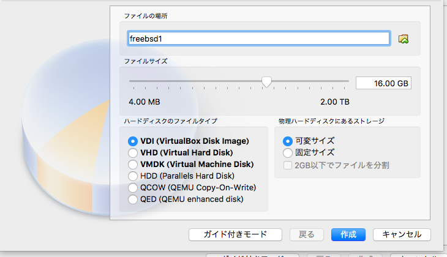
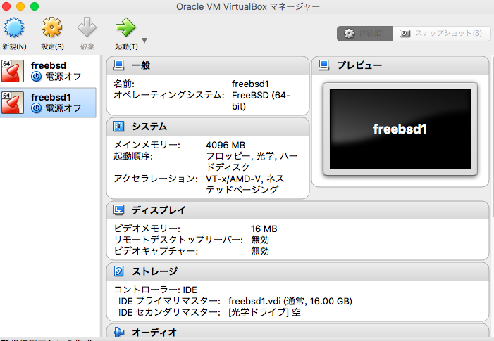
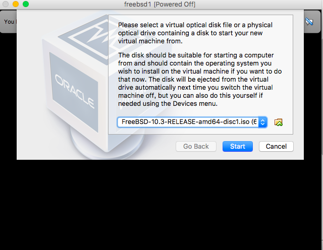
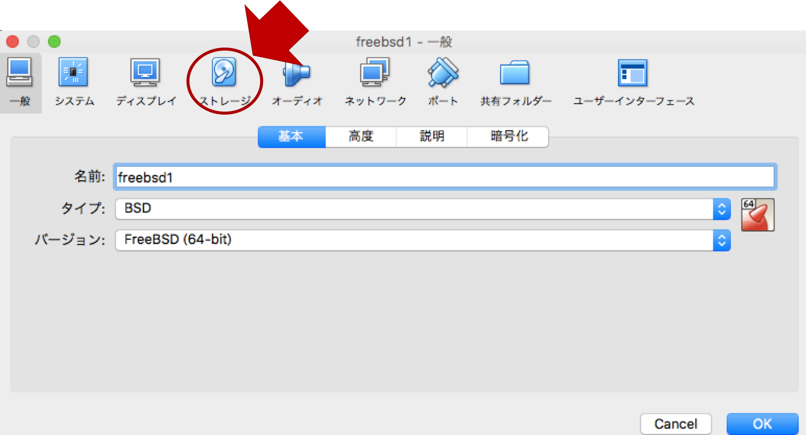
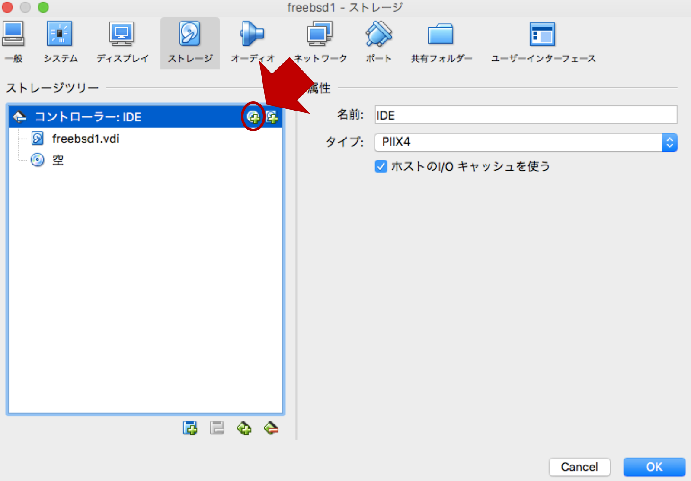
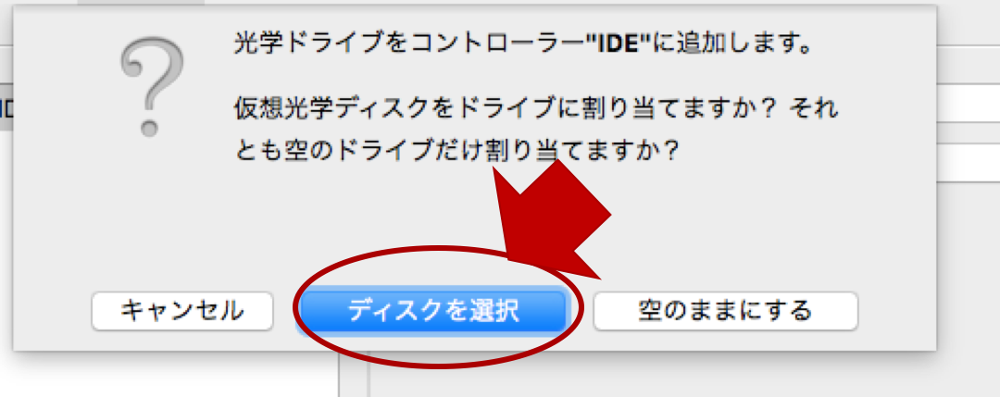
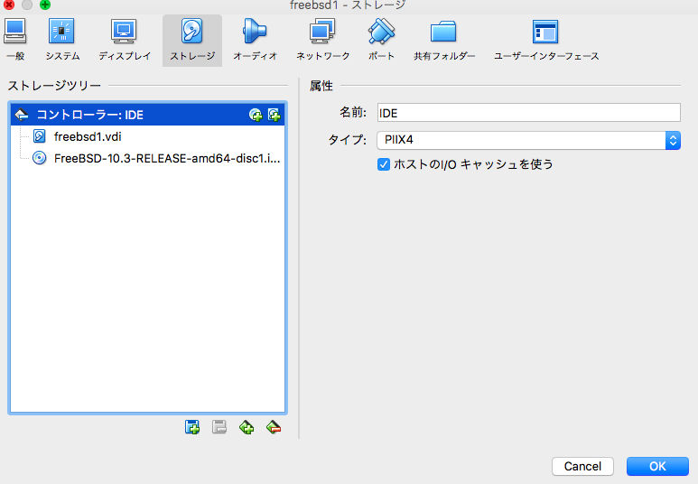

# Install FreeBSD on VirtualBox
## 環境
- Mac OS 10.12.4 (Sierra)
- Virtualbox 5.1.22
- FreeBSD-10.3-RELEASE
- CPU : amd64

## VirtualBoxの導入
<https://www.virtualbox.org/>  にアクセス

自分の環境にあったものを選択するとダウンロードが開始．今回はOS X Host

ダウンロードしたらそのままインストール作業
大した設定はないので省略

アプリケーションがインストールされ，以下の画面が表示されればOK

## FreeBSDイメージファイルのダウンロード
イメージファイルは，isoを選びます．
<https://www.freebsd.org/ja/where.html>
↑ここから環境に合わせてダウンロード．

## VirtualBoxのVMにFreeBSDをインストール
VirtuaBoxを起動する．  
新規を押して色々設定する．

成功すると以下のように左側に作成したマシンが表示されるので，マシンを起動する．

環境やフォルダの状態によるが，以下の画面が出た場合，okを押すことで，FreeBSDのisoイメージが自動でマウントされ，インストールのフェーズに入れる．

もしも表示されない，または，isoイメージファイルが見つからなかった場合は，VirtualBoxマネージャーでマシンを選んだ状態で設定を選択する．
そうすると，以下の画面が表示される．以下の画像の矢印通りに選択していく

FreeBSDのisoイメージファイルを選択すると

この状態になれば，OKを押してマシンを起動し直せば，FreeBSDのインストールフェーズに入ることができるはず．
